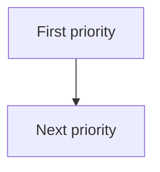

# Implementation Plan

<!--
Owned by the Systems Engineer, built in collaboration with Solutions
Architect's docs/PROJECT_DEFINITION.md. Sequences the build so the
most critical MVP items come first.
-->

## Build Sequence

<!-- Default: a single linear priority order, most critical first.
     This is enough for most projects — use it unless the note below
     genuinely applies. -->

1.

<!--
Only if this project is genuinely expected to grow through multiple
distinct phases — judge from docs/PROJECT_DEFINITION.md, not just a
longer feature list — define each phase along three axes instead of
one: system complexity, UI quality, and documentation rigor. Delete
this note and the table below if the simple list above is sufficient,
which it will be most of the time.
-->

## Phases (only if warranted — see note above)

| Phase | System Complexity | UI Quality | Documentation Rigor |
| --- | --- | --- | --- |
| 1 | | | |

## Sequence Diagram

<!-- A Mermaid diagram of the build order / dependencies. Renders
     natively on GitHub. Replace the placeholder below. -->

