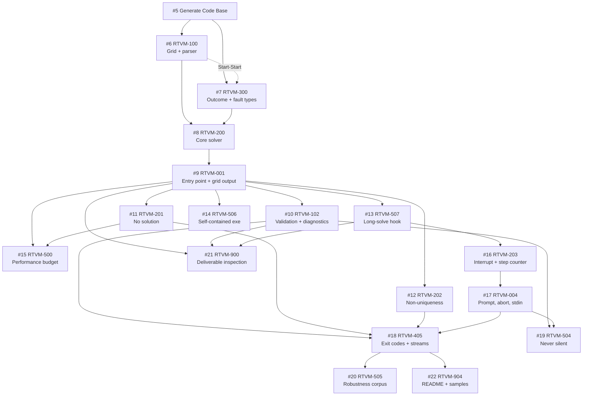

# Implementation Plan

<!--
Owned by the Systems Engineer, built in collaboration with Solutions
Architect's docs/PROJECT_DEFINITION.md. Sequences the build so the
most critical MVP items come first.
-->

> **Sources.** `docs/RTVM.md` (47 line items, all **Approved**),
> `docs/SDD.md` (commit `317a794`), `docs/PROJECT_DEFINITION.md` (all items
> **[CONFIRMED]**). Every one of the 47 RTVM items appears exactly once in the
> coverage map below — the map is the check that nothing was dropped between the
> RTVM and the issue tracker.

## Shape of this plan: one linear order, not phases

**Decision: a single linear priority order.** `docs/PROJECT_DEFINITION.md`
describes one MVP with a flat later-tier list in §4.6 (4×4 / 16×16 grids,
81-character output, file output, solve metrics, menus, generation, difficulty
rating). None of those later items carries its own UI-quality or
documentation-rigor target, and none of them is scheduled — each is "promoted on
the client's word". That is a backlog, not a second phase, so the three-axis
phase table (system complexity / UI quality / documentation rigor) would be
filled in with one row and no second row to compare it against. It has been
deleted rather than filled in.

The one forward-looking commitment the MVP does make is structural, not phased:
`docs/SDD.md` §2.3 derives `kGridSize` from `kBoxSize` and guards it with a
`static_assert`, so the 16×16 tier is a one-line change rather than a rewrite.
That obligation is carried by RTVM-903 and verified by TP-903 inside this
sequence — it needs no phase of its own.

## Build Sequence

Ordered most-critical-MVP-first. The numbering is the priority order; the
dependency graph below is what actually gates the work, and several of these run
concurrently.

| # | Issue | RTVM items | Why here |
| --- | --- | --- | --- |
| 1 | **#5 Generate Code Base** | — (establishes 900, 902, 906) | Everything depends on it. Scaffolding only. |
| 2 | **#6 `[RTVM-100]` Grid representation and puzzle parser** | 100, 101, 106 | Nothing can be tested end to end without a grid to test with. |
| 3 | **#7 `[RTVM-300]` Outcome, solve report, and fault types** | 300, 301, 302 | `SolveReport` is the solver's return type, so it precedes the solver; RTVM-302 gates every diagnostic message, so it precedes validation. |
| 4 | **#8 `[RTVM-200]` Core solver — unique solution** | 200 | `V1` — the whole point of the product. |
| 5 | **#9 `[RTVM-001]` Console entry point, input sourcing, solved-grid output** | 001, 002, 003, 400 | The first runnable program. Makes RTVM-200 externally observable; until this exists nothing above is verifiable from outside the process. |
| 6 | **#10 `[RTVM-102]` Input validation, fault precedence, diagnostics** | 102, 103, 104, 105, 009, 403 | `SN-4` in full — the second-largest block of user-visible behaviour. |
| 7 | **#11 `[RTVM-201]` No-solution detection and reporting** | 201, 402 | Second outcome class. |
| 8 | **#12 `[RTVM-202]` Non-uniqueness and the not-unique note** | 202, 401 | Third outcome class. Also what stops `P-BLANK` hanging. |
| 9 | **#13 `[RTVM-507]` Long-solve diagnostic hook** | 507 | §7 I-10: without it, RTVM-004…008 and RTVM-501…504 are not verifiable at all. Gates the entire long-solve branch. |
| 10 | **#14 `[RTVM-506]` Self-contained x64 executable** | 506 | Independent of the long-solve branch; runs concurrently with it. |
| 11 | **#15 `[RTVM-500]` Performance budget** | 500 | Needs a real process and the unsolvable case to time. |
| 12 | **#16 `[RTVM-203]` Cooperative interruptibility and step counter** | 203, 204 | Solver-side prerequisites of the prompt mechanism. |
| 13 | **#17 `[RTVM-004]` Progress prompt, abort, non-blocking stdin** | 004, 005, 006, 007, 008, 404, 501, 502, 503 | The §4.4.1 mechanism. Fourth and last outcome class (`Aborted`). |
| 14 | **#18 `[RTVM-405]` Exit-code mapping and stream separation** | 405, 406 | Aggregate assertions — meaningless until every outcome exists. |
| 15 | **#19 `[RTVM-504]` Never silent while working** | 504 | Cross-cutting; needs the prompt path and the diagnostic path both present. |
| 16 | **#20 `[RTVM-505]` Robustness corpus** | 505 | Asserts a property of the finished program. |
| 17 | **#21 `[RTVM-900]` Deliverable inspection** | 900, 902, 903, 906 | TP-903 cannot grep a core that does not exist yet. |
| 18 | **#22 `[RTVM-904]` README, test run, shipped samples** | 901, 904, 905, 907 | Documents the finished behaviour, including the final exit-code table. |

### Coverage map — all 47 RTVM items

| Category | Items | Issues |
| --- | --- | --- |
| `UI` (9) | 001, 002, 003 → #9 · 004…008 → #17 · 009 → #10 | #9, #10, #17 |
| `DATA-IN` (7) | 100, 101, 106 → #6 · 102…105 → #10 | #6, #10 |
| `CORE` (5) | 200 → #8 · 201 → #11 · 202 → #12 · 203, 204 → #16 | #8, #11, #12, #16 |
| `DATA-OUT` (3) | 300, 301, 302 → #7 | #7 |
| `OUT` (7) | 400 → #9 · 401 → #12 · 402 → #11 · 403 → #10 · 404 → #17 · 405, 406 → #18 | #9, #10, #11, #12, #17, #18 |
| `NFR` (8) | 500 → #15 · 501, 502, 503 → #17 · 504 → #19 · 505 → #20 · 506 → #14 · 507 → #13 | #13, #14, #15, #17, #19, #20 |
| `DELIV` (8) | 900, 902, 903, 906 → #21 · 901, 904, 905, 907 → #22 | #21, #22 |

## Deviations from the first-cut order, and why

Recorded so they read as decisions rather than drift. Both are sequencing calls,
not scope calls — neither changes what gets built.

1. **`DATA-OUT` (300, 302) moved ahead of the solver, not placed after the output
   items.** `SolveReport` is what `sudoku::solve` returns (`docs/SDD.md` §2.6),
   so the type has to exist before the solver compiles. Building the outcome type
   after RTVM-400/405, as first sketched, would have meant writing the solver
   against a placeholder return type and revising it immediately.

2. **UI plumbing (001, 002, 003) moved from late to #9, and merged with
   RTVM-400.** The first-cut order put the grid format before the UI, but every
   one of TP-400, TP-001, TP-002 and TP-003 is written as *"run the program,
   expect the `S-EASY` grid on stdout"*. The entry point and the output format
   are each other's test harness; sequencing them apart would have produced two
   issues neither of which could be verified alone. They are one issue —
   the first vertical slice — and everything downstream tests against a program
   that actually runs.

3. **No `DELIV` issue was manufactured where there is no work.** RTVM-900, 902
   and 906 are satisfied by #5 as it is built; they are *verified* under #21
   rather than given issues of their own, because `docs/PROJECT_DEFINITION.md`
   §7 acceptance criterion 8 requires every line item to reach `Verified` and an
   inspection nobody is assigned never runs. #21 and #22 are verification issues
   with fixes attached if the inspection fails, not re-builds.

4. **#17 is deliberately not split.** Nine RTVM items is the largest issue in the
   plan, but RTVM-004…008, 404 and 501…503 are one mechanism — `SolveSession`
   plus `StdinChannel` (`docs/SDD.md` §1.2, §1.3). Splitting them would create
   two issues editing the same two classes in a forced sequence, which buys no
   concurrency and adds a merge.

## Sequence Diagram

Solid edges are Finish-Start; the dashed edge is Start-Start.

Every issue also carries an explicit Finish-Start on **#5**, omitted from the
diagram edges above for legibility — it would otherwise be an edge from `A` to
all seventeen.

### Where the concurrency is

The graph has three deliberate fan-outs. If the project is serialising in
practice, one of these is where to look:

- **After #9** — five issues release at once (#10, #11, #12, #13, #14, plus #15
  once #11 lands). This is the widest point in the plan and it is the reason the
  first vertical slice is sequenced as early as it is.
- **#6 → #7** is Start-Start, not Finish-Start: `SolveReport` needs only the
  `Grid` declaration, so the two proceed together.
- **#14 and #15** sit entirely outside the long-solve branch (#13 → #16 → #17)
  and run alongside it.

The convergence points are #18 (needs every outcome class) and, after it, #20 and
#22. Those are genuinely serial: they assert properties of the whole finished
program.

## Status tracking

Each `[RTVM-nnn]` issue carries the requirement text, its `SN-<n>` traces, a
pointer to its `TP-<nnn>` procedure in `docs/RTVM.md`, and the relevant
`docs/SDD.md` sections. As each clears CI/CD, the Systems Engineer records the
commit SHA in the `Commit(s)` column of `docs/RTVM.md` and moves the item to
`Verified`. `docs/PROJECT_DEFINITION.md` §7 acceptance criterion 8 — *every line
item at `Verified`* — is the completion test for the MVP as a whole.
