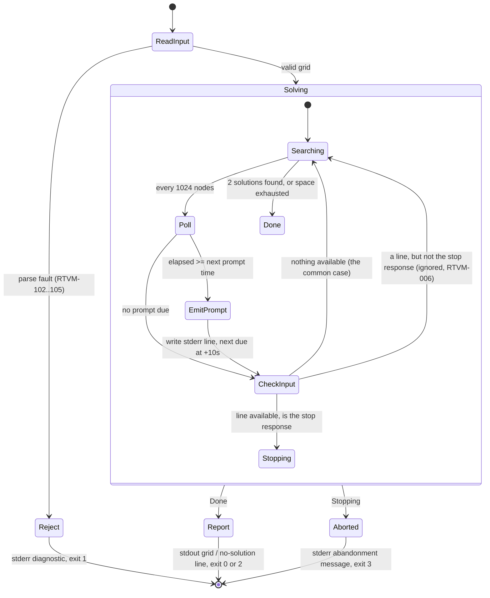

# Software Design Document (SDD)

<!--
Owned by the Systems Engineer, refined with the Software Engineer.
Describes the system architecture and the build/toolchain
conventions the codebase follows.
-->

> **Traceability.** Every decision below is made against
> `docs/RTVM.md` (commit `49c0376`, all line items **Approved**) and
> `docs/PROJECT_DEFINITION.md` (all items **[CONFIRMED]**). Where a decision
> exists to satisfy a specific requirement, that requirement's ID is cited
> inline. Where a decision was scope's to make and was returned to the Systems
> Engineer (Project Definition §4.4.1, §4.5), it is answered here in full.
>
> **This document, not the README, is where the RTVM-507 diagnostic hook is
> documented** — see §3.6. TP-507 checks both halves of that.

---

## Architecture

### 1.1 Shape of the system

One process. One binary. Three build artifacts:

| Artifact | Kind | Contains |
| --- | --- | --- |
| `SudokuCore` | Static library | Grid, parser, solver, formatter, result and fault types. **No stream, no `argv`, no console API, no environment access.** (RTVM-903) |
| `SudokuSolver` | Console application (x64) | `main`, command line, input sourcing, the solve session (timer + prompt + abort), stream/exit-code reporting, all English wording. |
| `SudokuSolver.Tests` | Native unit test DLL | Links `SudokuCore` directly; spawns `SudokuSolver.exe` for end-to-end procedures. |

The split is not stylistic. RTVM-903 (from `D-4`) requires the solver core to
be separable from console I/O so a later UI or a 16×16 grid tier does not
require rewriting it, and TP-903 verifies it by grepping the core's sources for
`std::cin`, `std::cout`, `std::cerr`, `printf`, `argv`, and console APIs. A
static library makes that mechanically true rather than a matter of discipline:
the core cannot reach the console because the console layer is not linked into
it.

Data flow through one run:

```
argv/stdin ──▶ InputSource ──▶ text ──▶ sudoku::parseGrid ──▶ Grid | InputFault
                                                                │
                                         SolveSession ◀─────────┤
                                    (implements SolveControl)   │
                                              │                 ▼
                                              └───▶ sudoku::solve ──▶ SolveReport
                                                                        │
                                            Reporter ◀──────────────────┘
                                                │
                                    stdout (result) │ stderr (diagnostics,
                                                    │          prompts)
                                                    └─▶ exit code 0|1|2|3
```

### 1.2 The §4.4.1 answer — how the prompt and abort are realised

> The client's question, recorded in `docs/PROJECT_DEFINITION.md` §4.4.1:
> *"we need to determine if that interrupt is possible in a command prompt
> application. Will that require multi-threading, or is there a simpler
> solution?"*

**Answer: it is possible, and it does not require multi-threading. The
application is single-threaded.**

The apparent need for a thread comes from one assumption — that reading the
user's reply means *waiting* for it. It does not. If the reply is **polled**
rather than awaited, there is nothing to wait on, and therefore nothing to run
concurrently with.

The design is a **cooperative poll driven from inside the solver's own search
loop**:

- The solver calls back into a `SolveControl` interface every
  `kPollNodeInterval` search nodes (default 1024 — see §1.5). At a 9×9 node
  rate of roughly 10⁶–10⁷ nodes/second this is a callback every few
  microseconds to a few milliseconds.
- The console layer's implementation of that interface (`SolveSession`) does
  two things on each call, both non-blocking, then returns:
  1. Reads the **wall clock** (`std::chrono::steady_clock`) and, if a prompt is
     due (15 s, then every 10 s — RTVM-501, RTVM-502), writes the prompt line
     to stderr.
  2. Asks the **control channel** whether a complete input line is available
     *right now*. If one is, and it is the stop response, it returns `false`,
     which the solver treats as an abort request.
- The solver checks the return value at its next node boundary and unwinds,
  yielding the `Aborted` outcome (RTVM-203, RTVM-005).

Because nothing in that loop ever waits, every one of the six §4.4.1
constraints falls out of the structure rather than needing to be defended:

| §4.4.1 constraint | How this design satisfies it | Verified by |
| --- | --- | --- |
| 1. Solving continues while a prompt is up and while a reply is awaited | The prompt is a `write` inside the search loop. The loop resumes immediately. There is no "awaiting" state. | RTVM-503 / TP-503 |
| 2. Abort at a prompt, exit `3` | Poll returns `false`; solver unwinds within one poll interval. | RTVM-005, RTVM-203 |
| 3. No answer required; default is continue | "No line available" is the overwhelmingly common poll result and is a no-op. Absence of input is indistinguishable from the normal case. | RTVM-006 / TP-006 |
| 4. Completed solve reported immediately despite an outstanding prompt | The solver returns on the *same thread* that prints. There is no rendezvous to miss and no reply to abandon. | RTVM-007 / TP-007 |
| 5. Unattended / piped / no-console run never blocks | The control channel is a null channel or a latched-EOF channel; it can only report "nothing available". | RTVM-008 / TP-008 |
| 6. Wall-clock timing, 15 s then every 10 s | `steady_clock` sampled at the poll; poll granularity is milliseconds against a ±1.0 s tolerance. | RTVM-501, RTVM-502 |

**Consequences of choosing this over a worker thread**, recorded so the
trade-off is on the record rather than rediscovered:

- No shared mutable state across threads, therefore no atomics, no mutexes, no
  memory-ordering reasoning, and no `docs/SDD.md` "Data Architecture" section
  (§1.4).
- No thread blocked on a console read at process exit — the failure mode that
  makes the thread-based version of this awkward on Windows, where a blocking
  `ReadFile` on `CONIN$` cannot be cancelled portably and the thread must be
  detached and leaked.
- Every timing and abort behaviour is deterministic and unit-testable without a
  console: a test implements `SolveControl` itself and drives the whole
  interaction synchronously (§3.5).
- The cost is that the solver must call the poll. That coupling already exists
  as a requirement — RTVM-203 (cooperative interruptibility) and RTVM-204
  (progress counter) both mandate it — so it is not new coupling introduced by
  this choice.

### 1.3 The sharp edge: a non-blocking read of standard input on Windows

This is the only genuinely difficult part of §1.2 and the part most likely to
be got wrong. `std::getline(std::cin, line)` **blocks**, and using it would
fail RTVM-006 and RTVM-008 outright — the two requirements that exist precisely
to stop this happening. It must not appear anywhere in the solve path.

**"The solve path" is meant literally, and the boundary is the solve.** From the
moment the solver is entered until it returns, no call may block — that is the
subject of RTVM-006 and RTVM-008, and §3.7's more absolute phrasing was written
about the *prompt* read. **Acquiring the puzzle happens strictly before the
solve starts, and there a bounded blocking read is permitted**, because RTVM-003
requires reading a puzzle the user may still be typing and no non-blocking
formulation of "wait for line 4" exists. Bounded means the bounds that already
apply — acquisition stops at 9 logical lines (`docs/RTVM.md` §7 I-2) and never
scans past 4096 bytes on one line (I-13) — and it still goes through
`StdinChannel`, never `std::cin`. Redirected or closed stdin reaches EOF, which
ends the read, so RTVM-008's non-interactive guarantee is untouched. See
`docs/RTVM.md` §7 **I-17**, which rules the contradiction between this section
and §3.7 as they were originally worded, and records the interactive case that
does legitimately wait forever (a user who types four lines and walks away).

There is no single Win32 call that non-blockingly tests any standard-input
handle for available data. The handle type must be established first and
dispatched on. `StdinChannel` does this **once, at startup**, from
`GetFileType(GetStdHandle(STD_INPUT_HANDLE))`:

| Detected kind | Detection | Availability test | Read |
| --- | --- | --- | --- |
| **Console** | `FILE_TYPE_CHAR` **and** `GetConsoleMode` succeeds | `GetNumberOfConsoleInputEvents` > 0, then `PeekConsoleInput` over the pending records looking for a key-down record with `wVirtualKeyCode == VK_RETURN` | Only then `ReadConsoleA` — a completed line is in the buffer, so the read returns without blocking. Line editing (backspace, echo) is left to the console, so the console mode is **not** modified and needs no restoring. |
| **Pipe** | `FILE_TYPE_PIPE` | `PeekNamedPipe` reports bytes available, and a `\n` is present in the accumulated buffer | `ReadFile` for **at most** the byte count `PeekNamedPipe` reported |
| **File** | `FILE_TYPE_DISK` | Always "may have data" | `ReadFile`; a disk read does not block indefinitely. EOF latches the channel closed. |
| **Null / unknown** | anything else, invalid handle, or `NUL:` (which is `FILE_TYPE_CHAR` but fails `GetConsoleMode`) | Never available | Never read |

Rules that make this safe:

- **Latch on EOF.** Once a channel has seen end of input it reports "closed"
  forever and issues no further reads. A script that pipes a puzzle and closes
  the pipe cannot cause a second read.
- **One owner of the stdin byte stream.** When the puzzle itself comes from
  stdin (RTVM-003) the same `StdinChannel` supplies it — the puzzle reader
  pulls the first 9 logical lines from the channel and the control channel
  continues from the same buffer afterwards. `std::cin` is **never** used, in
  either role. Two readers with independent buffering over one handle is the
  classic way to lose bytes to a look-ahead, and this rules it out by
  construction.
- **Two reads, one buffer.** The channel therefore exposes both a
  non-blocking `tryReadLine()` (the only form the solve path may call) and a
  blocking, byte-capped `readLineBlocking()` (callable **only** during
  acquisition, before the solve starts — I-17). They share the one accumulated
  buffer and the one EOF latch, so bytes typed ahead of the puzzle's ninth line
  are still there for the control channel afterwards.
- **Line-oriented, byte-safe.** The channel yields complete lines only. Bytes
  are accumulated in a `std::string` with explicit lengths; NUL bytes are data,
  never terminators (this is what makes the TP-505 NUL-byte case behave).
- **Stop response.** A line whose first non-whitespace character is `s` or `S`,
  or whose trimmed content case-insensitively equals `stop`. Any other line is
  ignored silently — it is not an error and does not abort (RTVM-006).

**Ctrl+C is deliberately not handled.** No `SetConsoleCtrlHandler` is
installed. No requirement asks for it; a handler runs on an OS-created thread
and would reintroduce exactly the concurrency §1.2 was chosen to avoid; and the
exit code it produces could not be one of the four RTVM-405 permits. The
documented stop gesture is the typed response, and that is the only one the
program claims.

### 1.4 Data architecture — not applicable, and why

`docs/RTVM.md` §8 item 5 makes the SDD's Data Architecture section conditional:
required only if the §4.4.1 answer introduces a second thread or process, in
which case the crossing of the abort signal and the solve result would need
specifying. §1.2 introduces neither. The application is a single process with a
single thread, all state is owned by one call stack, and there is no transfer
method, ordering guarantee, or storage question to answer.

The section is therefore **deliberately absent, not omitted**. If a future tier
ever moves the solver onto a worker thread, this section comes back and must
specify the abort-signal and result handoff before that change is made.

### 1.5 Algorithm — constraint propagation with MRV-ordered backtracking

Project Definition §4.5 returns the algorithm choice here: *"Any correct
method… This is the Systems Engineer's decision, not a scope one."* The binding
constraints are RTVM-500 (worst case under 10 s on `P-HARD17`), RTVM-203
(interruptible, abort honoured within 1.0 s), RTVM-202 (detect a *second*
solution, not merely find a first) and RTVM-204 (an observable progress count).

**Chosen: bitmask constraint propagation to fixpoint, then depth-first search
ordered by minimum remaining values (MRV).**

State, per search node:

- `std::array<CandidateMask, kCellCount> candidates` — one bit per digit.
- `std::array<CandidateMask, kGridSize> rowUsed, colUsed, boxUsed`.
- `std::array<Digit, kCellCount> cells` — the digits assigned so far.
- `int unsolvedCount`.

The `cells` array is not redundant with `candidates`, and the reason is
worth keeping: a one-bit-per-digit mask cannot distinguish *assigned* from
*one candidate remaining but not yet propagated*, and the report has to emit
digits. Recorded as delivered at [RTVM-200] (RTVM §9.7).

Propagation applied to fixpoint before every branch:

1. **Naked single** — a cell with exactly one candidate bit is assigned.
2. **Hidden single** — a digit with exactly one legal placement in a row,
   column or box is assigned there.
3. A cell reaching zero candidates is an immediate contradiction; the branch
   fails.

Search:

- Choose the unassigned cell with the fewest candidates (MRV). A cell with two
  candidates is preferred over one with nine, which is what keeps the 17-clue
  case in milliseconds rather than seconds.
- Try each candidate in ascending digit order. **Ascending order is normative**
  — it makes "the first solution found" (RTVM-202, RTVM-401) reproducible run
  to run, which a test procedure needs even though TP-202 is careful not to
  assert *which* of the two solutions appears.
- Undo by restoring a saved copy of the node state (≈300 bytes as delivered;
  maximum depth 81, so ~50 KB of stack in the worst case). Copying is chosen
  over incremental undo bookkeeping deliberately: it is a rounding error
  against the budget and it is the version a maintaining engineer can read
  (`ST-2`, `D-4`).

Uniqueness (RTVM-202, §7 I-8):

- `SolveOptions::maxSolutions == 2`. The **first** solution found is copied
  into the report immediately; the search then continues. It stops the moment a
  second is found. It never enumerates or counts beyond two.
- One solution → `Solved`. Two → `SolvedNotUnique`, reporting the first.
  Zero → `NoSolution`. This also disposes of `P-BLANK` (81 empty cells), which
  finds its second solution instantly instead of hanging.

Interruptibility and progress:

- `nodesExplored` increments once per search node. It is `std::uint64_t`, plain
  (not atomic — there is one thread), exposed live through
  `SolveProgress::nodesExplored` on every poll and post hoc through
  `SolveReport::nodesExplored`. This is RTVM-204, and it is what makes
  RTVM-503's "the solve did not pause" an observable fact (§3.5).
- `SolveControl::onPoll` is called every `kPollNodeInterval = 1024` nodes.
  Worst-case abort latency is one poll interval plus the unwind — microseconds
  against RTVM-203's 1.0 s.

**Rejected alternatives**, recorded so they are not re-litigated:

| Alternative | Why not |
| --- | --- |
| Knuth Algorithm X / dancing links | Genuinely faster on adversarial inputs, but the MRV solver is already three orders of magnitude inside the RTVM-500 budget, so the speed buys nothing. It costs several hundred lines of pointer-dance that a client engineer must understand before extending — a direct loss against `ST-2` / `D-4`. |
| Human-style logic rules only (no guessing) | Cannot solve every valid puzzle and cannot establish uniqueness, so it fails RTVM-200 and RTVM-202. |
| Naive backtracking, first-empty-cell order | Correct, and would probably pass RTVM-500 on `P-HARD17`, but with no margin and no headroom for a future 16×16 tier. MRV costs about fifteen lines. |
| Exact-cover via `std::bitset` SAT-style encoding | No requirement needs it; adds a representation the RTVM does not describe. |

### 1.6 Behaviour of the solve session — state diagram

This is the one formal model this project earns. The rest of the MBSE/SysML
menu is deliberately skipped: there is one real actor plus a scripted caller
(no use case diagram needed), the decomposition in §1.1 falls straight out of
the RTVM's category blocks (no block definition diagram), and there are three
components with a single linear data flow (no internal block diagram). No
interface control document either — the two external interfaces this program
has, the puzzle file format and the exit codes, are already normatively
specified in `docs/RTVM.md` §6.1/§6.2 and RTVM-405, and a second copy would
only drift.

The solve session *is* worth a diagram, because the interleaving of solving,
the timer, an unanswered prompt, a reply, an abort and a completion is exactly
the kind of concurrent-sounding branching that prose renders ambiguous — and
ambiguity here is the risk §4.4.1 was raised about.



Two properties to read off the diagram, because they are the ones the
requirements turn on:

- **There is no state in which the program is waiting.** `CheckInput` returns
  on the same tick it is entered. An unanswered prompt is not a state; it is
  the absence of a transition.
- **`Done` is reachable from `Searching` regardless of prompt history.** That
  is RTVM-007: a solve finishing while a prompt is outstanding reports and
  exits, with nothing to abandon and nobody to wait for.

---

## Coding Standards

Established here and open to refinement with the Software Engineer at the
Generate Code Base step; §3.7 lists the two points where their confirmation is
specifically wanted.

### 2.1 Language and general style

| Aspect | Convention |
| --- | --- |
| Standard | C++17 (`/std:c++17`). No compiler extensions relied on; `/permissive-` is on. |
| Headers | `#pragma once`. No `using namespace` at namespace scope in any header. |
| Indentation | 4 spaces, no tabs. 100-column soft limit. |
| Namespaces | `sudoku` for the core, `sudoku::cli` for the console layer, `sudoku::test` for test helpers. |
| Files | `PascalCase.h` / `PascalCase.cpp`, one primary type or one cohesive free-function group per pair, named for what it contains (`Grid.h`, `Solver.h`, `StdinChannel.h`). |
| Const-correctness | `const` by default on locals, parameters and methods. `[[nodiscard]]` on every function returning a result the caller must not drop. |
| Enums | `enum class` always, with an explicit underlying type. |
| Macros | None, other than include guards (which are `#pragma once` anyway). |
| Raw pointers / `new` | Not used. Owning containers (`std::array`, `std::string`, `std::vector`) or values only. |

### 2.2 Naming

| Kind | Convention | Example |
| --- | --- | --- |
| Type, struct, enum class | `PascalCase` | `SolveReport`, `FaultKind` |
| Enum class value | `PascalCase` | `Outcome::SolvedNotUnique` |
| Free function, method | `camelCase` | `parseGrid`, `onPoll`, `nodesExplored` |
| Local, parameter | `camelCase` | `candidateMask` |
| Member variable | `m_camelCase` | `m_cells` |
| Compile-time constant | `kPascalCase` | `kGridSize`, `kPollNodeInterval` |
| Namespace | lowercase | `sudoku::cli` |
| Test method | `camelCase` describing the assertion, prefixed with the RTVM ID it verifies | `rtvm202_secondSolutionStopsTheSearch` |

Prefixing test methods with the RTVM ID is not decoration: it is what lets a
test report, a commit message and an issue title all be searched on the same
`RTVM-202` string, which is the whole point of the ID scheme in `docs/RTVM.md`.

### 2.3 Data schema — grid and dimensions (RTVM-903)

RTVM-903 requires the grid dimension to be a **single named constant**, and
TP-903 greps the codebase for a bare literal `9` used as a dimension, expecting
zero occurrences outside that constant's definition. `docs/PROJECT_DEFINITION.md`
§4.2 puts 4×4 and 16×16 in a later tier, so this is load-bearing.

```cpp
namespace sudoku {

using Digit         = std::uint8_t;    // 0 == empty, 1..kGridSize == a given
using CandidateMask = std::uint16_t;   // one bit per digit, bit 0 == digit 1

inline constexpr int   kBoxSize   = 3;
inline constexpr int   kGridSize  = kBoxSize * kBoxSize;    // the only "9"
inline constexpr int   kCellCount = kGridSize * kGridSize;
inline constexpr Digit kEmpty     = 0;

static_assert(kGridSize <= 16,
    "CandidateMask must be widened before kBoxSize > 4");

class Grid {
public:
    [[nodiscard]] Digit at(int row, int col) const;   // 0-based internally
    void set(int row, int col, Digit d);
    [[nodiscard]] bool isComplete() const;
private:
    std::array<Digit, kCellCount> m_cells{};
};

} // namespace sudoku
```

Notes that matter for the later tier:

- `kGridSize` is **derived from** `kBoxSize`, so a 16×16 tier is one line.
- `CandidateMask` is the one type a size change also touches. The
  `static_assert` makes that fail loudly at compile time rather than silently
  truncating.
- Rows and columns are **0-based internally** and rendered **1-based** as
  `r<row>c<col>` (RTVM-105). The conversion happens in exactly one place —
  `cellRefFromZeroBased()` in `InputFault.h` (§2.5) — which is called **where a
  fault is constructed**, not where it is rendered. A `CellRef` inside an
  `InputFault` is therefore already 1-based, and `Messages` prints it with no
  arithmetic of its own. Off-by-one in a diagnostic is the cheapest possible way
  to fail TP-103, TP-104 and TP-302 at once, which is why the `+1` is spelled
  once and never open-coded. *Reworded 2026-08-13 (issue #7): this clause
  previously said the conversion happened "in `Messages`", which contradicted
  §2.5's 1-based `CellRef`. Ruled in `docs/RTVM.md` §7 **I-16** in favour of
  §2.5 — the reading the delivered parser and TP-302 were already built and
  passed under.*

### 2.4 Data schema — the outcome type (RTVM-300)

RTVM-300 requires a closed set of exactly five outcomes, with no run producing
none and no run producing two; TP-300 unit-tests the type itself for that
property.

```cpp
enum class Outcome : std::uint8_t {
    Solved, SolvedNotUnique, InvalidInput, NoSolution, Aborted
};

// The populated-field invariant table below, stated once and answerable from
// the outcome alone — a caller never probes a report to discover it.
[[nodiscard]] bool outcomeCarriesGrid(Outcome outcome);
[[nodiscard]] bool outcomeCarriesFault(Outcome outcome);

class SolveReport {
public:
    static SolveReport solved(Grid g, std::uint64_t nodes);
    static SolveReport solvedNotUnique(Grid g, std::uint64_t nodes);
    static SolveReport invalidInput(InputFault f);
    static SolveReport noSolution(std::uint64_t nodes);
    static SolveReport aborted(std::uint64_t nodes);

    [[nodiscard]] Outcome outcome() const;
    [[nodiscard]] bool hasGrid() const;
    [[nodiscard]] const Grid& grid() const;            // precondition: hasGrid()
    [[nodiscard]] bool hasFault() const;
    [[nodiscard]] const InputFault& fault() const;     // precondition: InvalidInput
    [[nodiscard]] std::uint64_t nodesExplored() const;
    [[nodiscard]] bool hasCompleteGrid() const;        // RTVM-301
private:
    explicit SolveReport(Outcome o);   // private; no default ctor, so no "none"
    Outcome m_outcome;
    std::optional<Grid> m_grid;
    std::optional<InputFault> m_fault;
    std::uint64_t m_nodesExplored = 0;
};
```

There is deliberately **no** `Unknown`, `None`, `Pending` or `Error` member and
**no** default constructor. A `SolveReport` can only be produced by one of the
five named factories, so "exactly one outcome" is a property of the type rather
than a thing tests have to catch. The populated-field invariant:

| Outcome | `grid()` | `fault()` | Exit code (RTVM-405) |
| --- | --- | --- | --- |
| `Solved` | complete grid | — | `0` |
| `SolvedNotUnique` | complete grid, first found | — | `0` |
| `InvalidInput` | — | populated | `1` |
| `NoSolution` | — | — | `2` |
| `Aborted` | — | — | `3` |

The first three columns of that table are `outcomeCarriesGrid` /
`outcomeCarriesFault`; `hasGrid()` and `hasFault()` must agree with them for
every report, and TP-300 asserts exactly that. The **exit-code column is
deliberately not represented in the core** — RTVM-405 maps outcomes to exit
codes in the console layer (§2.8), and the core knows nothing about process
exit (RTVM-903).

`hasCompleteGrid()` is RTVM-301 stated as a predicate: true only when the
report carries a grid in which every one of `kCellCount` cells holds a digit
`1..kGridSize`. `Grid::isComplete()` answers only the "no empty cell" half, and
only a grid-carrying outcome is required to answer both, so the check that
matches the requirement lives on the report, where the outcome is known. The
`solved()` / `solvedNotUnique()` factories are the solver's promise that it
holds; this is how the promise is checked rather than assumed (TP-301).

**The closed set is closed by the build, not by discipline.** A `static_assert`
pins each enumerator to its numeric value, so *inserting* a member fails to
compile rather than silently renumbering an outcome another translation unit
was compiled against; *appending* one is caught by the two `outcomeCarries*`
switches, which carry no `default` label (MSVC C4062 at /W4, gcc/clang
`-Wswitch`). Two further `static_assert`s state the "never none" half as a
property of the type: `!std::is_default_constructible_v<SolveReport>` and
`!std::is_constructible_v<SolveReport, Outcome>`. "Never two" needs no
assertion — the outcome is a single scalar member. Note that
`is_default_constructible` is evaluated from outside the class, so it catches a
**public** default constructor only; that is the intended scope, since a
private one cannot produce an outcome-less report anyway.

*Adopted as specified 2026-08-13 (issue #7): `outcomeCarriesGrid`,
`outcomeCarriesFault`, `hasGrid`, `hasFault` and `hasCompleteGrid` were added
at [RTVM-300] and flagged for adoption, the same route `ParseResult` and
`toCompactString` took. No rename and no signature change — this section now
matches `src/SudokuCore/SolveReport.h` as delivered.*

### 2.5 Data schema — structured input fault (RTVM-302)

RTVM-302 requires the fault to be **data**, not a pre-formatted sentence, so
that all wording lives in the output layer. TP-302 asserts the object contains
no English.

```cpp
enum class FaultKind : std::uint8_t {
    MissingLine,       // fewer than kGridSize lines
    LineTooShort,
    LineTooLong,
    IllegalCharacter,
    RowDuplicate,
    ColumnDuplicate,
    BoxDuplicate,
    SourceUnreadable   // populated by the CLI, not the parser
};

struct CellRef {
    int row = 0;                                   // 1-based; 0 == not applicable
    int col = 0;
    [[nodiscard]] constexpr bool isApplicable() const noexcept;   // row && col
};

[[nodiscard]] constexpr bool operator==(const CellRef&, const CellRef&) noexcept;
[[nodiscard]] constexpr bool operator!=(const CellRef&, const CellRef&) noexcept;

// The one place the 0-based internal coordinates of §2.3 become the 1-based
// form a fault carries. Out of range == not applicable, never a wrapped cell
// name (RTVM-505).
[[nodiscard]] constexpr CellRef cellRefFromZeroBased(int row, int col) noexcept;

struct InputFault {
    FaultKind     kind{};
    int           line = 0;              // 1-based; 0 == n/a
    int           observedLength = 0;    // LineTooShort / LineTooLong
    char          character = '\0';      // IllegalCharacter
    int           digit = 0;             // *Duplicate
    CellRef       first;                 // IllegalCharacter, *Duplicate
    CellRef       second;                // *Duplicate only
    std::string   path;                  // SourceUnreadable only
    std::uint32_t systemError = 0;       // SourceUnreadable only; an errno value
                                         // on every platform (§7 I-18), 0 == n/a
};
```

**`systemError` carries an `errno` value, on every platform** — not a
`GetLastError` code, which is what this section originally said. `InputSource`
opens files with `std::ifstream`; the MSVC CRT sets `errno` on a failed open
just as glibc does, while `GetLastError` after a CRT call is incidental rather
than specified, so carrying whichever domain the calling path happened to set
would make the number uninterpretable without a provenance tag. One domain, no
tag. Nothing asserts the field numerically — TP-009 asks only that stderr names
the path and states it could not be opened — so it exists purely to let
`Messages` render a reason, through one `strerror`-family helper there and
nowhere else. CRT/locale-supplied text is not a literal in the fault and so does
not breach RTVM-302; correspondingly, TP-009 and TP-403 must not pin an exact
CRT phrase. `SourceUnreadable` also covers a failed **read**, not just a failed
open: TP-009's second case is an existing *directory*, which fails at open on
Windows but opens and then fails to read on a POSIX host. Ruled on issue #9 —
`docs/RTVM.md` §7 **I-18**; binding on **#10**, which owns the wording.

`CellRef` is **1-based**, and it becomes 1-based at construction: every
fault-producing path builds its cells through `cellRefFromZeroBased()` and
nothing else adds one. `Messages` renders `r{row}c{col}` straight from the
fault and performs no arithmetic — see §2.3 and `docs/RTVM.md` §7 **I-16**,
which rules the contradiction between the two clauses as they were originally
worded. `isApplicable()` is how the output layer asks whether a fault names a
cell at all, so no caller has to know that `0` is the sentinel; equality exists
so a test can assert a cell in one line. An out-of-grid coordinate yields a
*not applicable* reference rather than a nonsense cell name, because RTVM-505
requires that no input path produce a crash or a garbage diagnostic.

**No prose, enforced structurally.** Every member of `InputFault` is a
coordinate, a code, a count or a single character; there is deliberately no
`message`, `description` or `detail` string. The one `std::string` is `path`,
which is a filesystem path echoed back to the user and is populated only for
`SourceUnreadable`. TP-302 asserts this by naming every member in a structured
binding, so adding a wording field fails to compile rather than failing a
review.

`InputFault` is a pure data type and lives in the core, but it performs no I/O:
the `SourceUnreadable` case is constructed by the console layer (RTVM-009,
§7 I-9) after a failed open, because opening files is not the core's business.
Keeping one fault vocabulary across both layers is what lets `Messages` be the
single place any English exists.

`observedLength` carries one sentinel value, declared beside `parseGrid` in
`Parser.h`:

```cpp
inline constexpr int kLengthExceedsCap = kMaxLineBytes + 1;  // docs/RTVM.md §7 I-13
```

A line that runs past `kMaxLineBytes` is never scanned further, so its true
length is unknown and `observedLength` is set to `kLengthExceedsCap` instead.
`Messages` renders that case as **"more than 4096 characters"** (I-13's own
wording) and must never print the sentinel as a number; every other value of
`observedLength` is the exact stripped length and is printed as such. Added
2026-08-13 with the parser (#6); the rendering half belongs to [RTVM-102] (#10).

Validation precedence is fixed by RTVM-105 and §7 I-7 —
shape → illegal character → contradiction — and the parser returns on the
**first** fault found. It never returns a list, and a rejected puzzle is never
handed to the solver. One exception, ruled on #6 and recorded as `docs/RTVM.md`
§7 **I-15**: interior horizontal whitespace is classified as an
`IllegalCharacter` during the shape pass and outranks the length fault of the
line it sits on, because RTVM-106 declares it an illegal character and
"line 3 has 10 characters" is the less useful of the two diagnostics. The
exception is that narrow — it never crosses lines, and it never applies to a
non-whitespace character.

### 2.6 Core interfaces

```cpp
namespace sudoku {

// A single logical line is capped before being declared malformed, so a 1 MB
// one-line input is a prompt shape fault rather than a megabyte buffered to
// reach the same answer (docs/RTVM.md §7 I-13).
inline constexpr int kMaxLineBytes = 4096;

// Either a grid or the first fault found — never both, never neither.
class ParseResult {                      // returned by parseGrid
public:
    [[nodiscard]] static ParseResult success(Grid g);
    [[nodiscard]] static ParseResult failure(InputFault f);

    [[nodiscard]] bool ok() const;
    [[nodiscard]] const Grid& grid() const;         // precondition: ok()
    [[nodiscard]] const InputFault& fault() const;  // precondition: !ok()

private:
    ParseResult() = default;                        // no public default ctor
    bool       m_ok = false;
    Grid       m_grid{};
    InputFault m_fault{};
};

struct SolveProgress {
    std::uint64_t nodesExplored = 0;
    int           currentDepth  = 0;
};

class SolveControl {                     // implemented by the CLI and by tests
public:
    virtual ~SolveControl() = default;
    // Return false to request abort. Must not block. Called every
    // SolveOptions::pollNodeInterval nodes.
    virtual bool onPoll(const SolveProgress& progress) = 0;
};

struct SolveOptions {
    int                       maxSolutions      = 2;      // RTVM-202, §7 I-8
    std::uint32_t             pollNodeInterval  = 1024;   // RTVM-203, RTVM-204
    std::chrono::milliseconds minSolveDuration{0};        // RTVM-507 hook, §3.6
};

[[nodiscard]] ParseResult parseGrid(std::string_view text);          // no streams
[[nodiscard]] SolveReport solve(const Grid& puzzle,
                                const SolveOptions& options,
                                SolveControl& control);
[[nodiscard]] std::string formatGrid(const Grid& grid);              // RTVM-400
[[nodiscard]] std::string toCompactString(const Grid& grid);         // TP-100/TP-101

} // namespace sudoku
```

`ParseResult` deliberately mirrors `SolveReport`'s shape (§2.4): private default
constructor and named factories, so that "neither a grid nor a fault" is
**unrepresentable** rather than merely undocumented. That is the same move §2.4
uses to make RTVM-300 ("exactly one outcome, never none and never two") a
property of the type instead of a discipline the caller has to keep. It carries
the *first* fault only — RTVM-105 / §7 I-7 fix the precedence and the parser
returns on the first one found, so there is never a list to carry. Added
2026-08-07: §2.6 named `ParseResult` as `parseGrid`'s return type from the start
but never defined it; the Software Engineer scaffolded this shape at Generate
Code Base and it is adopted as specified. Changing it is [RTVM-100] (#6)'s
business, and any change lands back here.

`formatGrid` returns the 13-line block of `docs/RTVM.md` §6.2 as a `std::string`
and writes to nothing. TP-400 asserts it byte for byte; keeping it a pure
function is what makes that a unit test rather than a process capture, and
keeps the core free of streams for TP-903.

**Every line it returns is terminated, the last one included** — 13 terminators,
so the returned string is a complete unit of output and `Reporter` writes it and
adds nothing. Delivered that way at #9 and now pinned normatively in
`docs/RTVM.md` §6.2, because RTVM-401's note line has to land on its *own* line
rather than being appended to the final row. Line count and width are derived
from `kGridSize` / `kBoxSize` rather than written as literals, so a future grid
size cannot silently produce a misaligned block; a `static_assert` bounds the
format at single-digit grids, since a 16×16 tier needs a §6.2 format decision
before it needs code.

`toCompactString` returns the `kCellCount`-character form: every cell in
row-major order, `0` for an empty cell, no separators and no newline. **Adopted
2026-08-13 as specified** — TP-100 requires a round trip back to the
81-character form and TP-101 compares three grids for identity, and §2.6 named
no function either could use, so the Software Engineer added one at [RTVM-100]
(#6) and flagged it, the same route `ParseResult` took. It is a *test and
comparison* surface, not an output format (RTVM-400's rendering is
`formatGrid`) and not an input format — `parseGrid` accepts `kGridSize` lines
only, so an 81-character single line is malformed. It lives beside `formatGrid`
in `GridFormat.h`/`.cpp` rather than on `Grid`, which keeps `Grid` free of
formatting.

### 2.7 Console layer

| Type | Responsibility |
| --- | --- |
| `CommandLine` | First argument is a path; further arguments ignored (RTVM-002). |
| `InputSource` | Supplies puzzle text from a file, or from `StdinChannel` when there is no argument (RTVM-003). Produces a `SourceUnreadable` fault on failure to **open or read** — `systemError` is an `errno` value (§2.5, §7 I-18). Files are opened in **binary** so a CR is data the parser rules on (RTVM-106), not something the CRT silently removed. With a path present, stdin is never read at all: that is why the file wins in TP-002's third case. |
| `StdinChannel` | The single owner of the stdin byte stream. Handle-type dispatch per §1.3; non-blocking reads on the solve path, and a byte-capped blocking read during puzzle acquisition only (§7 I-17). |
| `SolveSession` | Implements `SolveControl`. Owns the `steady_clock` start point, the next-prompt deadline, and the stop-response check. |
| `Reporter` | Stream assignment and exit code per the RTVM-405 / §7 I-4 / I-5 table. The only code that touches `stdout`. |
| `Messages` | Every user-visible English string, in one file. Nothing elsewhere contains a sentence. |

### 2.8 Streams, wording, and exit codes

`Reporter` is the only place stream choice is decided, because RTVM-406 is an
aggregate assertion (stdout must contain none of `Still working`, `abandoned`,
`r1c1`, `Error`, `could not`) and per-message rules are what drift.

| Message | Stream | Source |
| --- | --- | --- |
| Solved grid (13 lines, §6.2) | **stdout** | RTVM-400 |
| Non-unique note | **stdout** | RTVM-401 |
| `This puzzle has no solution.` | **stdout** | RTVM-402, §7 I-4 |
| Input diagnostic | **stderr** | RTVM-403 |
| Abort message | **stderr** | RTVM-404, §7 I-5 |
| Progress prompt | **stderr** | RTVM-004 |

**Normative progress-prompt line** (pinned here; `docs/RTVM.md` §6.2 carries the
same string):

```
Still working (15s elapsed). 1234567 steps taken. Type s then Enter to stop; no response needed - the solve continues.
```

The elapsed figure is whole seconds. The step count is the live RTVM-204
counter, and it is present on purpose: it is what makes RTVM-503 ("the solve
did not pause") observable from outside the process, from stderr alone, without
instrumentation. The leading `Still working (Ns elapsed).` sentence is intact
and unbroken so TP-004's regex `Still working \(\d+s elapsed\)\.` matches as
written.

**Output is ASCII only** (RTVM-400, §6.2) — no box-drawing characters, no code
page assumptions, and the streams are used in binary-safe fashion so that the
byte comparison TP-400 performs is meaningful.

### 2.9 Error handling

- **Expected outcomes are never exceptions.** Malformed input, an unsolvable
  puzzle, an unreadable file and an abort are all values (`SolveReport`), not
  throws.
- **`main` has a catch-all.** `try { … } catch (const std::exception&) { … }
  catch (...) { … }`, emitting a diagnostic to stderr and returning **`1`**.
  RTVM-405 forbids any exit code outside `{0,1,2,3}`, so an internal fault has
  to map onto one of the four; `1` is the only one meaning "no result was
  produced because something was wrong with this run". This mapping is a
  deliberate decision, not a fallback nobody thought about — it is what makes
  TP-505's guarantee (no crash dialog, no unhandled-exception text, exit code
  always in the set) achievable over an adversarial corpus.
- **Input reads are bounded.** The puzzle reader stops after `kGridSize`
  logical lines (`docs/RTVM.md` §7 I-2) and caps any single line at
  `kMaxLineBytes = 4096` before declaring it malformed. TP-505's 1 MB
  single-line and 10 000-line cases are therefore shape faults reported
  promptly, not a megabyte buffered to produce the same answer. Lines within
  the cap report their exact observed length (TP-102 expects that); a line
  beyond it reports "more than 4096 characters". Recorded as `docs/RTVM.md`
  §7 I-13.
- **Byte-oriented input.** `std::string` with explicit sizes throughout; never
  `strlen`, never a NUL terminator assumption. TP-505 feeds NUL bytes, a UTF-8
  BOM, full-width digits, and the contents of an `.exe`; all of these are
  simply illegal characters at a named position (RTVM-103), reported with exit
  `1`.

---

## Build & Toolchain Conventions

This section is the artifact the `DELIV` inspections read. RTVM-900…907 are
verified by inspection **against this document** — TP-900 to TP-907 have no
runtime behaviour to execute, so if a convention is not written here it will
not be built and the inspection will fail.

### 3.1 Repository and solution layout (RTVM-900, RTVM-903, RTVM-907)

```
/SudokuSolver.sln
/src/SudokuCore/           SudokuCore.vcxproj          (Static library)
/src/SudokuSolver/         SudokuSolver.vcxproj        (Application, console, x64)
/tests/SudokuSolver.Tests/ SudokuSolver.Tests.vcxproj  (DLL, native unit test)
/samples/                  easy.txt hard17.txt unsolvable.txt malformed.txt nonunique.txt
/README.md
/docs/
```

- `.sln`, `.vcxproj` and `.vcxproj.filters` are **tracked in git** (RTVM-900 —
  "not source files alone"). `.gitignore` excludes `.vs/`, `x64/`, `Debug/`,
  `Release/`, `*.user`, and nothing else that matters.
- `SudokuSolver` and `SudokuSolver.Tests` both reference `SudokuCore` as a
  project reference. `SudokuCore` references nothing. That dependency direction
  is RTVM-903 made structural.
- `samples/` lives at the repository root and matches the `docs/RTVM.md` §6.1
  fixtures **byte for byte** (TP-907). A post-build step copies `samples/` into
  `$(OutDir)` so that both the end-to-end tests and TP-506's "copy the exe and
  `samples/` to a clean machine" work without a path convention nobody wrote
  down.

**Two repository-level files are load-bearing requirements, not housekeeping**
(added 2026-08-07 after both were found wrong in the template at Generate Code
Base — `docs/RTVM.md` §9.3):

- **`.gitignore` must not exclude `*.sln` or `*.vcxproj`.** A stock Unreal or
  "Visual Studio" template ignore file often does. RTVM-900 is "an openable
  committed solution, not source files alone", and an ignored `.sln` fails it
  *silently* — the tree looks complete and the client's clone has no solution
  to open. Exclude build output only: `.vs/`, `x64/`, `Debug/`, `Release/`,
  `*.user`.
- **`.gitattributes` must pin `samples/*.txt` to LF** (`samples/*.txt text
  eol=lf`). A blanket `* text=auto` checks the samples out as CRLF on Windows,
  and TP-907 diffs them against the §6.1 fixtures **byte for byte** — it would
  fail on line endings alone, on the client's machine and nowhere else.
  `.sln` / `.vcxproj` are pinned to CRLF, as VS writes them.

### 3.2 Compiler and linker settings (RTVM-902, RTVM-906, RTVM-506)

| Setting | Value | Because |
| --- | --- | --- |
| Configurations | `Debug` and `Release`, platform **x64 only** — the `Win32`/`x86` platform is removed from the solution and from every project | TP-906: "the only platform configured is x64" |
| Platform toolset | `v143` | VS 2022 stock |
| Windows SDK version | `$(WindowsTargetPlatformVersion)` = `10.0` (meaning "latest installed"), **not** a pinned build number | A pinned SDK build fails to load on a client machine with a different SDK, which would fail TP-901's "no undocumented setup step" |
| Language standard | `<LanguageStandard>stdcpp17</LanguageStandard>` (`/std:c++17`) | RTVM-906, `D-7` |
| Conformance | `/permissive-` | Keeps the source honest and portable to a later toolset |
| Warnings | `/W4`, and **not** `/WX` | `/W4` is the useful level. Warnings-as-errors means a future MSVC that adds a warning turns the client's build into a failure — a direct loss against `D-2` and RTVM-901 |
| Runtime library | **`/MT` (Release), `/MTd` (Debug)** — static CRT | RTVM-506 / TP-506: the exe must run on a clean Windows machine with **no redistributable installed** and no missing-DLL dialog. Dynamic `/MD` would require the VC++ redistributable and fail that inspection |
| Optimisation | Release `/O2 /DNDEBUG`; Debug `/Od /RTC1` | TP-500 measures the Release build with no debugger attached |
| Subsystem | Console | `D-7` |

**No third-party anything** (RTVM-902, `D-3`). Concretely, and these are the
things TP-902 looks for: no `packages.config`, no `vcpkg.json`, no
`conanfile.*`, no NuGet package reference, no committed third-party source
tree, and no include or library path pointing outside the repository, the
Windows SDK, or the MSVC toolset. Standard library plus Win32 only.

**No cross-platform build files** (RTVM-906, `D-7`). No `CMakeLists.txt`, no
`Makefile`, no `meson.build`, anywhere in the repository. This is a client
decision, not an oversight, and it should not be "helpfully" added later.

### 3.3 Test framework (RTVM-905, RTVM-902)

Project Definition §4.5 returns this choice here as well.

**Chosen: the Microsoft native C++ unit test framework —
`Microsoft::VisualStudio::CppUnitTestFramework`** (a "Native Unit Test Project"
in VS 2022).

| Candidate | Verdict |
| --- | --- |
| **CppUnitTestFramework** | **Chosen.** Ships with the VS 2022 "Desktop development with C++" workload. No package restore, no download, nothing to vendor. Runs from Test Explorer (a client engineer's likely route) *and* from `vstest.console.exe` on the command line (a scripted route). Satisfies RTVM-905 and RTVM-902 without qualification. |
| GoogleTest | Rejected. VS ships a GoogleTest adapter, but the library itself would still be a third-party dependency to vendor or restore — against `D-3` and specifically against TP-902's "no committed third-party source tree". |
| Catch2 / doctest | Rejected for the same reason. Single-header makes vendoring cheap, but "cheap to vendor" is not "not a third-party dependency", and TP-902 is an inspection, not a judgement call. |
| Hand-rolled assertion harness | Rejected. It would satisfy the letter of RTVM-902 and lose Test Explorer integration, which is most of what RTVM-905's "runnable by the client" is worth. |

**One test project, two kinds of test inside it:**

- **Unit tests** link `SudokuCore` directly and cover TP-100…106, TP-200…204,
  TP-300…302 and TP-400.
- **End-to-end tests** spawn `$(OutDir)SudokuSolver.exe` through a
  `sudoku::test::ProcessRunner` helper — `CreateProcess` with anonymous pipes
  for stdin/stdout/stderr, returning captured streams and the exit code. These
  cover TP-001…009, TP-401…406 and TP-500…507, which are all about process
  behaviour, streams and exit codes and cannot be unit tests.

**`ProcessRunner` does not exist yet, and has its own issue — #24.** #9
delivered the first process-level behaviour (TP-001/002/003) and ran those three
procedures by hand rather than building the harness, on the reasonable ground
that it is Windows-only `CreateProcess` code nobody in this pipeline can compile
and that blind pipe plumbing deadlocks in ways a Test Engineer who cannot edit
files could not fix. This paragraph is here so the gap is visible from the SDD
and not only from `docs/RTVM.md` §9.8.1, which records the ruling: **§3.3 stands
unchanged**, #24 builds the helper with the same `_WIN32`/POSIX seam
`StdinChannel.cpp` uses so these procedures execute in this pipeline as well as
under MSVC, and it ports TP-001/002/003 onto it first as a known-good baseline.
Until then, a process-level procedure may be hand-run — but a UI or OUT
requirement must not reach **Verified** on hand-run evidence once #24 exists.
Two harness details that are design, not taste: pump stdout and stderr
concurrently (draining one to EOF first deadlocks whenever the child fills the
other pipe's buffer), and close the child's stdin write end, because TP-003 and
TP-008 depend on the child seeing EOF.

**Slow tests are categorised.** TP-501, TP-502, TP-504 and TP-507 run to 60 s
by design. They carry
`TEST_METHOD_ATTRIBUTE(L"TestCategory", L"Slow")` so the default
developer run stays fast, and the documented full-suite command includes them.

**If Test Explorer does not list the tests on the first Windows run**, the first
thing to check is a missing
`<ProjectSubType>NativeUnitTestProject</ProjectSubType>` in the test project's
`Globals` property group — the stock template emits it and the scaffold does
not. Recorded as a watch-item, not a defect: nobody has yet been able to
reproduce it either way (`docs/RTVM.md` §9.1).

Documented commands (these go in the README, RTVM-905 / TP-905):

```
:: everything
vstest.console.exe /Platform:x64 x64\Release\SudokuSolver.Tests.dll

:: fast subset
vstest.console.exe /Platform:x64 x64\Release\SudokuSolver.Tests.dll ^
    /TestCaseFilter:"TestCategory!=Slow"
```

### 3.4 README expectations (RTVM-904, RTVM-901, RTVM-907)

TP-904 and TP-901 are inspections against the README, so its required contents
are specified here rather than left to taste. `README.md` must contain:

1. **Prerequisites** — Visual Studio 2022 with the *Desktop development with
   C++* workload. Name it explicitly; TP-901 fails on any manual step performed
   that the README does not state, and the test framework in §3.3 comes from
   that workload.
2. **Build** — open `SudokuSolver.sln`, select `Release|x64`, Build Solution;
   plus the equivalent `msbuild` command line.
3. **Run** — at least one worked example command **and its exact output**
   (TP-904 checks for both).
4. **Input format** — 9 lines of 9 characters; `1`–`9` givens; **`0` and `.`
   both accepted** (TP-904 checks for this statement specifically); LF or CRLF;
   trailing newline optional; leading/trailing whitespace on a line ignored;
   content after the ninth line ignored.
5. **Exit codes** — the `0`/`1`/`2`/`3` table.
6. **Samples** — all five files named, each with the outcome it is expected to
   produce (TP-907).
7. **Tests** — how to run them, both routes from §3.3.

The README must **not** mention the RTVM-507 diagnostic hook. TP-507 inspects
for its absence there and its presence here.

### 3.5 The RTVM-204 progress counter — how it is exposed

RTVM-204 requires the search-step count to be readable "by the rest of the
application and by the test suite **while the solve is in flight**". Under the
single-threaded design of §1.2 that is not a concurrency problem, but it does
need a route:

- **To the prompt layer** — `SolveProgress::nodesExplored`, passed to
  `SolveControl::onPoll` on every poll. `SolveSession` reads it there and puts
  it in the prompt line (§2.8), which is what makes RTVM-503 externally
  observable.
- **To unit tests (TP-204, TP-203, TP-503)** — the test implements
  `SolveControl` itself. Its `onPoll` records `(steady_clock::now(),
  progress.nodesExplored)` samples and can return `false` at a chosen moment to
  exercise abort latency. No thread, no sleep, no timing race in the test.
- **To end-to-end tests (TP-503 at process level)** — parse the step figure out
  of consecutive stderr prompt lines and assert it strictly increases across
  every prompt window.
- **After the fact** — `SolveReport::nodesExplored()`.

### 3.6 The RTVM-507 diagnostic hook — documented here, not in the README

RTVM-507 exists because of `docs/RTVM.md` §7 I-10: any solver fast enough for
RTVM-500 dispatches even the known brute-force-hostile grids in milliseconds,
so **no puzzle input exists that reaches the 15 s prompt threshold**. Without a
hook, RTVM-004…008 and RTVM-501…504 are unverifiable end to end.

**The hook is the environment variable `SUDOKU_DIAG_MIN_SOLVE_MS`.**

| Property | Specification |
| --- | --- |
| Activation | Set `SUDOKU_DIAG_MIN_SOLVE_MS` to a positive integer number of milliseconds. Absent, empty, zero, or unparseable → completely inert. |
| Effect | Once the solver has determined its result, it continues to perform **genuine search work** — repeating the full two-solution search on a scratch copy of the original grid and discarding the results — until at least that many milliseconds of wall clock have elapsed since the solve began. It then returns the outcome it had already found, unchanged. |
| Why real work, not a sleep | A sleep would make RTVM-204's counter stall and RTVM-503's assertion vacuous, and would make abort latency (RTVM-203) untested at exactly the moment it matters. The extension polls `SolveControl` and increments `nodesExplored` exactly as the normal search does, so every prompt-path test exercises the real mechanism. |
| Where it is read | The **console layer** reads the environment variable at startup and passes the value in `SolveOptions::minSolveDuration`. The core never calls `getenv`, preserving RTVM-903. |
| Why not a command-line switch | RTVM-002 fixes the meaning of the first argument (a puzzle path) and requires further arguments to be ignored. A hidden switch would collide with that contract. An environment variable sits entirely outside it. |
| Why it cannot be triggered accidentally | It is not reachable from puzzle content in any form — TP-507 asserts this — and normal use never sets the variable. |
| Effect when inert | One `getenv` at startup and `minSolveDuration == 0`, which the solver never tests inside its loop. Ordinary behaviour is byte-identical and TP-500's timings are unaffected. |

Example (this belongs in test tooling and in this document, nowhere else):

```
set SUDOKU_DIAG_MIN_SOLVE_MS=60000
SudokuSolver.exe samples\hard17.txt
```

### 3.7 Points left to the Software Engineer — outcomes

Two implementation-level points were left here for the Software Engineer's
judgement at the Generate Code Base step. Both are now answered (issue #5,
2026-08-07); the original wording of each is kept so the reasoning behind the
outcome is still readable.

#### 1. Static CRT and the test project — **fallback taken**

*Original:* §3.2 specifies `/MT` and `/MTd` throughout so the shipped exe
satisfies RTVM-506 on a clean machine. `SudokuCore` and `SudokuSolver.Tests`
must match the same CRT linkage to link. If `CppUnitTestFramework` cannot be
linked against the static CRT in the installed VS 2022, the **test project
alone** may use `/MD` `/MDd` — RTVM-506 constrains the delivered executable,
not the test DLL.

**Outcome.** The fallback is taken. `SudokuSolver.exe` and `SudokuCore.lib`
remain `/MT` and `/MTd`; **`SudokuSolver.Tests` alone is `/MD` and `/MDd`**,
because `CppUnitTestFramework` ships linked against the dynamic CRT and a `/MT`
test DLL fails with `LNK2038: mismatch detected for 'RuntimeLibrary'`.
**RTVM-506 is unaffected** — it constrains the delivered executable, which is
still statically linked.

That has one structural consequence: a `/MD` test DLL also cannot link the
`/MT` `SudokuCore.lib`. Rather than add `Debug-Test` / `Release-Test`
configurations (an MSBuild project builds one configuration per solution
configuration, so the core would have to be duplicated), **the test project
lists `SudokuCore`'s `.cpp` files as its own `ClCompile` items** and compiles
them under its own CRT setting. The `ProjectReference` on `SudokuCore` is kept
with `LinkLibraryDependencies=false`, so build order and the RTVM-903
dependency direction still hold structurally, and the core still demonstrably
compiles and links with no console-layer object file present. Nothing about the
delivered executable changes.

**Provisional on one point:** this was decided from documentation, not from an
MSVC link — the pipeline has no Windows environment (`docs/RTVM.md` §9.1). If
the first real `Debug|x64` build shows `CppUnitTestFramework` linking happily
against `/MT`, revert to a plain library link and simplify this section; that
is strictly the nicer arrangement and the only reason it wasn't chosen is the
expected `LNK2038`.

#### 2. Console availability probe — **still open, deliberately**

*Original:* §1.3 tests for a completed line by peeking for a `VK_RETURN`
key-down record before calling `ReadConsoleA`. If that proves unreliable
against a particular console host, the acceptable alternatives are
`_kbhit()`/`_getch()` from `<conio.h>` (CRT, stock, not third-party) for the
console case only, keeping the pipe and file cases as specified. What is **not**
acceptable under any circumstance is any call that can block —
`std::getline(std::cin, …)`, a bare `ReadFile` on a console handle, or
`std::cin >>`. RTVM-006 and RTVM-008 exist to catch exactly that.

**Amended 2026-08-13 (issue #9), and this is the binding wording:** "under any
circumstance" is binding on the **solve path** — the prompt read, which is what
this point is about — and **not** on acquiring the puzzle before the solve
starts, where RTVM-003 requires a wait that no non-blocking formulation can
express. See §1.3 and `docs/RTVM.md` §7 **I-17** for the ruling and its bounds.
`std::cin` remains banned in both roles for the separate reason in §1.3 (one
owner of the byte stream). The prohibition on blocking anywhere the solver is
running is unchanged and remains absolute.

**Outcome.** Nothing decided and nothing foreclosed, which is the right state
at scaffold time: the choice can only be made against a real console host.
`StdinChannel` exposes `kind()`, `isClosed()` and `tryReadLine()` only, holds
the handle as an opaque `void*`, and keeps `<windows.h>` out of its header —
so either route drops in behind that interface without touching a caller. The
decision belongs to **[RTVM-004] (#17)**, which owns the prompt, the abort and
the non-blocking stdin path; the non-blocking constraint above is binding on it
either way.
